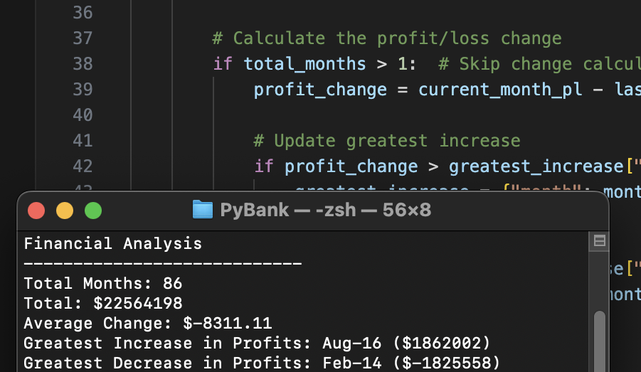
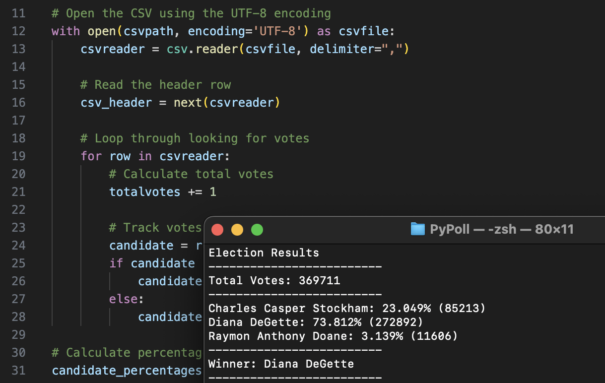

# python-challenge
Python Data Analysis Applications: PyBank and PyPoll

## Contents
1. [Overview](#1-overview)  
2. [Repository](#2-repository)  
3. [Deployment](#3-deployment)  
4. [Data Analysis](#4-data-analysis)  
5. [References](#5-references)  

## 1. Overview
This challenge involves creating two Python-based data analysis applications: **PyBank** and **PyPoll**. These apps simulate real-world scenarios where Python programming is used to replace Excel for advanced data analysis tasks.  

**PyBank** focuses on analysing financial records to extract key insights such as total profits, average changes, and identifying significant profit fluctuations.  
**PyPoll** is designed to modernise a rural town’s vote-counting process by determining election results, vote percentages, and identifying the winner through Python scripting.  


## 2. Repository
The repository consists of the following structure:

- [`PyBank/`](PyBank)
  - [`main.py`](PyBank/main.py)  
  - [`resources/`](PyBank/resources)
    - `budget_data.csv`  
  - [`analysis/`](PyBank/analysis)  
    - `financialanalysis.txt`  
- [`PyPoll/`](PyPoll)
  - [`main.py`](PyPoll/main.py)  
  - [`resources/`](PyPoll/resources)
    - `election_data.csv`  
  - [`analysis/`](PyPoll/analysis)
    - `electionresults.txt`  


## 3. Deployment
Before running the scripts, ensure the following Python libraries are installed:
- `os`
- `csv`

To deploy, follow these steps:  

1. **Download the Source Files**  
   Clone or download the repository to your local machine.  

2. **Run PyBank**

- Open a terminal and navigate to the `PyBank` directory:  
```
cd PyBank
```

- Run the `main.py` file:
```
python main.py
```

- Results will be written to `PyBank/analysis/financialanalysis.txt`.

3. **Run PyPoll**  
- Open a terminal and navigate to the `PyPoll` directory:  
```
cd PyPoll
```

- Run the `main.py` file:
```
python main.py
```

- Results will be written to `PyPoll/analysis/electionresults.txt`.


## 4, Data Analysis

### PyBank
This challenge addresses the following questions:
- **How many months are included in the dataset?**  
- **What is the total profit/loss over the entire period?**  
- **What is the average change in profit/loss during the period?**  
- **Which month had the greatest increase in profits?**  
- **Which month had the greatest decrease in profits?**

**Analysis Results**:  
- The total number of months: **86**  
- Net total profits: **$22,564,198**  
- Average change: **$-8,311.11**  
- Greatest increase: **August 2016 ($1,862,002)**  
- Greatest decrease: **February 2014 ($-1,825,558)**  



### PyPoll
This challenge addresses the following questions:
- **What is the total number of votes cast?**  
- **Who are the candidates?**  
- **What percentage of votes did each candidate receive?**  
- **What are the total votes for each candidate?**  
- **Who won the election based on the popular vote?**

**Analysis Results**:  
- Total votes: **369,711** 
- Candidate breakdown:
- **Charles Casper Stockham**: 23.049% (85,213 votes)  
- **Diana DeGette**: 73.812% (272,892 votes)  
- **Raymon Anthony Doane**: 3.139% (11,606 votes)  
- **Winner**: Diana DeGette  



## 5. References
- Python Libraries: `os`, `csv`
- Dataset for **PyBank**: `PyBank/resources/budget_data.csv`  
- Dataset for **PyPoll**: `PyPoll/resources/election_data.csv`  
- Data for this dataset was generated by edX Boot Camps LLC, and is intended for educational purposes only.
